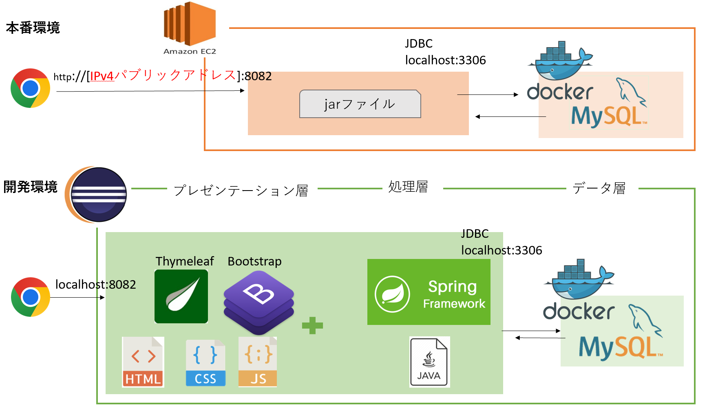

## SpringBootでCRUD機能を備えたwebアプリ「図書管理アプリ」

下記の技術要素を使用します。各自インストールしてください。

【エディタ】Eclipse 

【言語】Javaライブラリ/ Springライブラリ

【ビルド】Apache Maven

【クラウド】AWS CLI/ EC2 (Linux、t2.micro)

【プレゼンテーション層】

　　静的な画面 :HTML

　　動的な画面 :テンプレートエンジン (Thymeleaf)

　　デザイン 　:CSS + JavaScript (Bootstrap)

【ロジック層】画面遷移・CRUD処理・認証 : (Spring Framework)

【データ層】　コンテナ(Docker) + RDB(MySQL)

## ローカル環境で起動する手順

**①Eclipseでwebアプリケーションを立ち上げる**

　□EclipseをCドライブ直下にインストール

　□Java JDKをインストール

　□「bookmanager」フォルダのZipを解凍後、C:pleiades > 20xx-xx > workspace に配置する

　□Eclipseのタスクバー

　ファイル＞ファイルシステムからプロジェクトを開く ＞ディレクトリー でworkspaceに置いた「bookmanager」を開く

**②webアプリケーションにDB（MySQL）と接続する**

　□DB（MySQL）を用意するためにDocker環境構築をインストールする

　以下のサイトを参考にする

　https://chigusa-web.com/blog/windows%E3%81%ABdocker%E3%82%92%E3%82%A4%E3%83%B3%E3%82%B9%E3%83%88%E3%83%BC%E3%83%AB%E3%81%97%E3%81%A6python%E7%92%B0%E5%A2%83%E3%82%92%E6%A7%8B%E7%AF%89/

　□Docker Desktopを立ち上げたうえで、以下のコマンドを実行し、DBとテーブルを作成

`docker run -it -p 3306:3306 --name bookmanager -e MYSQL_ROOT_PASSWORD=rootpass -d mysql:latest`

`docker exec -it bookmanager bash`

root@:/# `mysql -u root -p`

mysql> `create database bookmanager;`

mysql> `use bookmanager;`

□DBができたら、[ＳＱＬ（ＤＤＬ）](https://github.com/HagaInsector/bookmanager/blob/main/SQL)を実行

**③webブラウザからアクセス**
 
　webブラウザでURL `http://localhost:8082/`を叩く

　→ ログイン画面が表示される

　→ BookManager / BookManager　でログインする

以上

## AWSでEC2にデプロイする手順

**①Eclipse　でビルド**

　□プロジェクトを右クリック＞実行＞Maven inststall

　□「target」フォルダ直下にjarファイルができる

**②ローカル環境からクラウド環境（AWS EC2）にJarファイルを転送**

`scp -i pemファイル "jarファイルのパス" ユーザー名@パブリックDNS:転送先のパス`

**②webアプリケーションにDB（MySQL）と接続する**

`sudo amazon-linux-extras install docker`

`sudo service docker start`

`docker run -it -p 3306:3306 --name bookmanager -e MYSQL_ROOT_PASSWORD=rootpass -d mysql:latest`

`sudo docker exec -it bookmanager bash`

`mysql -u root -p`

mysql> `create database bookmanager;`

mysql> `use bookmanager;`

□DBができたら、[ＳＱＬ（ＤＤＬ）](https://github.com/HagaInsector/bookmanager/blob/main/SQL)を実行
　
**③クラウド環境（AWS EC2）でwebアプリケーションを実行**

 `nohup java-jar 転送されたjarファイル`

**④webブラウザからアクセス**
　webブラウザでURL `http://[IPv4パブリックアドレス]:8082/`を叩く
　
　→ ログイン画面が表示される

　→ BookManager / BookManager　でログインする

以上　

　
